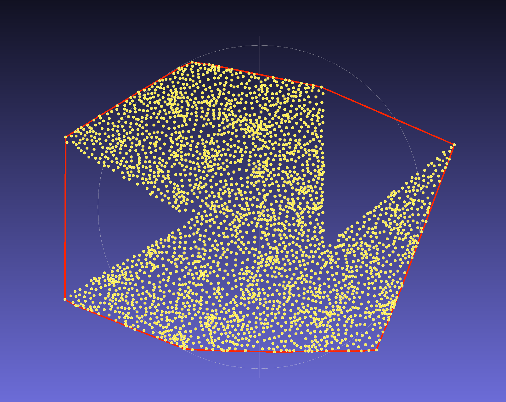
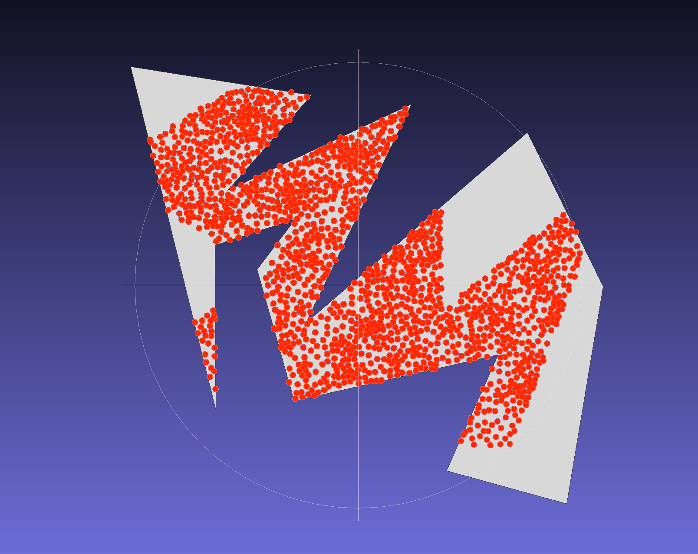

# Assignment 1 Report

## 1. Convex Hull

### Implementation

- function `det`
    - compute the determinant of two vectors.
- struct `Compare`
    - implement the operator of `()`
    - if the determinant is greater than 0, then it's counter clockwise.
    - if the determinant is 0, then put the closer one at first.
    - if the determinant is less than 0, then it's clockwise.
- function `salientAngle`
    - if the determinant is greater than 0, then it's not a salient angle.
    - if the determinant is 0, then put the further one at first.
    - if the determinant is less than 0, then it's a salient angle.
- a custom function `comp`
    - used to sort the points and find the left-bottom-most point.
- function `convex_hull`
    1. sort the points with function `comp` to find the left-bottom-most point and assign that point to the `Compare` base point.
    2. sort the rest of the points in the order of counter clockwise.
    3. put the first three points in the hull
    4. for the rest of the points `p[i]`, if the next-to-last point, last point, and the point `p[i]` is a salient angle and the size of the hull is larger than 1, then pop the last point in the hull. Otherwise, append `p[i]` to the hull.
- function `load_xyz`
    - use file stream to get the values.

### Result

A file called `output.obj`, which contains vertices and lines written in the `.obj` file format. This file contains 24 vertices and 24 lines.

## 2. Point in Polygon

### Implementation

- function `det`
    - same as the Part 1, but actually not used.
- function `intersect_segment`
    1. assume one line is $a + t\cdot u$ and another line is $c + s\cdot v$, where $u = b - a$ and $v = d - c$
    2. solve the linear equation to find $t$ and $s$. If $0 < t < 1$ and $0 < s < 1$, then the intersect exists, and otherwise it doesn't.
    3. store the intersect, though it's not used.
- function `comp_x` and `comp_y`
    - two functions used to find the minimum x and minimum y.
- function `is_inside`
    1. find the minimum x and minimum y and assign an outside point.
    2. find if there exists an intersect for every edge and the "query-outside" line and get the number of the intersects.
    3. if the number of intersects is odd, then it's inside the polygon, and otherwise it isn't.
- function `load_xyz`, 'load_obj`, `save_xyz`
    - simple functions interacting with files.

### Result

A file called `result.xyz`, which contains 1663 points and each point is store in a format of `x y z` in each line.

## System Environment

- MacOS Monterey 12.6
- Apple clang version 11.0.0 (clang-1100.0.33.17)
- cmake version 3.20.5